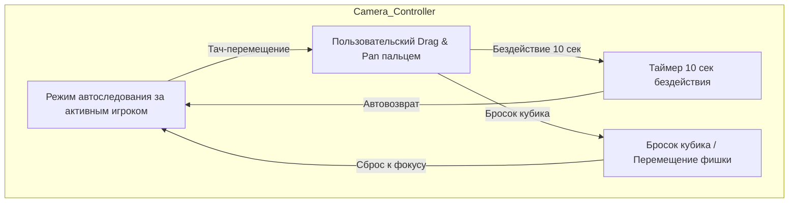

# План развития: Улучшение читаемости доски, динамическая камера со свободным скроллом и пошаговая анимация фишек

## 1. Проблемы и цели
1. **Проблема читаемости**: Вся доска из 40 клеток была сжата в квадрат 340×340 px. Тексты и цены не читались. Делаем увеличенное, сочное и четкое 2.5D поле.
2. **Динамическая камера + Свободное перемещение (Free Pan & Auto-Reset)**:
   - Автоматическое следование за фишкой активного игрока.
   - Возможность свободно двигать и осматривать поле пальцем (Drag & Pan).
   - **Автовозврат**: если поле не трогают 10 секунд — камера плавно возвращается к автоследованию.
   - **Мгновенный возврат**: при броске кубиков или начале хода камера сразу центрируется на активной фишке.
3. **Пошаговая анимация фишек (Bouncy Hop Engine)**:
   - Фишки не телепортируются, а прыгают шаг за шагом от стартовой клетки до финиша.
   - Тактильная отдача Haptics на каждом шаге и анимация бонуса при прохождении поля «Вперед».

---

## 2. Архитектура и технические решения

### 2.1. Читаемость доски (Board Scale & High-Res 2.5D Tiles)
- Размер игрового поля увеличен до ~880px, плитки получают четкую геометрию, объемные тени и крупные читаемые шрифты (12-14px).
- Сочные цвета для групп предприятий, значки вокзалов/коммуналок, понятные индикаторы уровня (3D-домики 🏠 и отели 🏨) и цветные ленты владельцев.

### 2.2. Камера: Автофокус + Drag & Pan + Таймер автовозврата
- Движок камеры на CSS 3D Transforms (`translate3d(x, y, 0) scale(...) rotateX(...) rotateZ(...)`).
- Сенсорное управление: `onTouchStart`, `onTouchMove`, `onTouchEnd` / Mouse Drag.
- Таймер неактивности на 10 секунд для возврата в `auto-follow` режим.
- Кнопка принудительного возврата фокуса / переключения «Вся доска».

### 2.3. Пошаговая физичная анимация фишек (Pawn Hop & Move Engine)
- Пошаговый расчет маршрута `fromIndex -> toIndex` (с учетом перехода через 0).
- Параболический прыжок `translateY(-18px)` с динамической тенью и haptics `triggerHaptic('light')`.
- Плавное панорамирование камеры вслед за прыгающей фишкой.
- Всплывающий бейдж `+200$` при прохождении клетки Start.

---

## 3. Задачи к выполнению

- [ ] 1. Редизайн и увеличение масштаба доски (крупные 2.5D плитки, читаемые шрифты, четкие цвета и 3D-домики)
- [ ] 2. Разработка движка динамической камеры (Drag-to-pan, автофокус на активном игроке, таймер автовозврата 10 сек, мгновенный сброс при броске)
- [ ] 3. Реализация пошаговой анимации прыжков фишки (bouncy hop, расчет пути по клеткам, haptic feedback на каждом шаге)
- [ ] 4. Синхронизация камеры со следованием за прыгающей фишкой и визуальные эффекты (проход через «Вперед», приземление)
- [ ] 5. Полировка мобильного интерфейса и тестирование в Telegram Mini App
