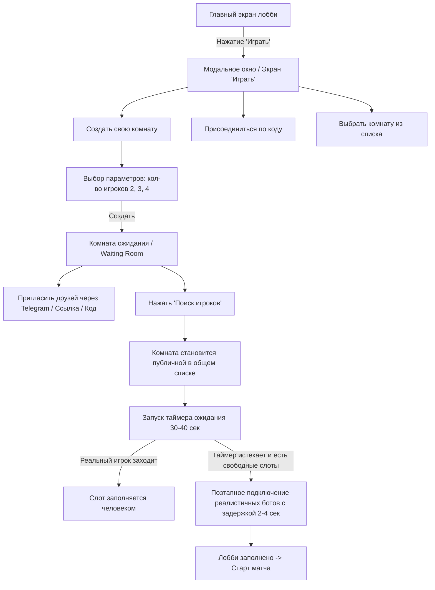

# План реализации системы комнат и матчмейкинга с реалистичными ботами

## 1. Архитектура и User Flow

---

## 2. Ключевые компоненты

### 2.1. Изменения в типах (`packages/shared/src/types.ts`)
- `RoomSummary`: добавление `isSearching?: boolean`, `hostDisplayName: string`.
- `create_room` payload: `{ player: PlayerState; maxPlayers: number; isPrivate?: boolean }`.
- `ActiveRoom` / `RoomState`: поддержка `maxPlayers: 2 | 3 | 4`, `isSearching: boolean`, `searchTimer: any`.

### 2.2. Серверная логика (`packages/server/src/roomManager.ts` & `index.ts`)
1. **Поддержка динамического количества участников**: 2, 3, 4 игрока.
2. **Публичный список комнат**:
   - Комната отображается в публичном списке, если хост нажал кнопку «Поиск игроков» (`isSearching = true` и `!isGameStarted` и `activePlayers < maxPlayers`).
   - Автоматический broadcast обновленного списка комнат при изменении статусов.
3. **Матчмейкинг и генерация реалистичных ботов**:
   - При `start_matchmaking`: запуск таймера на 30-40 сек.
   - Если в течение 30-40 сек слоты не заполнились живыми игроками, запускается очередь добавления ботов:
     - Бот 1 подключается с задержкой, например, 2.5 сек.
     - Бот 2 подключается с задержкой еще через 3 сек.
   - **Генератор реалистичных профилей ботов**:
     - Имена реальных людей (напр. *Артем Васильев, Дарья_К, Maxim_99, Никита Морозов, Elena_Finance, CryptoShark* и т.д.).
     - Аватарки (реалистичные аватары / Telegram-стиль).
     - ELO рейтинг в диапазоне рейтинга хоста ±100-150.
     - Скрытие явных надписей "AI / Бот" в UI, чтобы они ощущались живыми соперниками.
   - Когда все слоты заполнены, комната автоматически готова к старту или автоматически стартует через короткий обратный отсчет (3.. 2.. 1.. В бой!).

### 2.3. Клиентский интерфейс (`packages/client/src/components/LobbyView.tsx`)
1. **Главная кнопка «Играть»**:
   - Большая сочная 3D кнопка «ИГРАТЬ» по центру.
2. **Экран/Модалка выбора игры**:
   - Кнопка «Создать комнату»:
     - Селектор количества участников: **2 игрока** (дуэль 1 на 1), **3 игрока**, **4 игрока** (классика).
   - Блок «Вход по 6-значному PIN-коду».
   - Список «Доступные комнаты» (активные публичные комнаты, находящиеся в поиске игроков, с кнопкой «Присоединиться» и индикатором `[2/4]`, `[1/2]` и именем хоста).
3. **Экран ожидания (Waiting Room)**:
   - Отображение слотов в соответствии с выбранным `maxPlayers` (2, 3 или 4 слота).
   - Кнопка «Пригласить друга в Telegram» + копирование PIN.
   - Внизу большая кнопка «🔍 Поиск игроков» (если поиск не начат):
     - При нажатии кнопка переходит в режим активного поиска: пульсирующий индикатор, таймер `Поиск соперников... 00:32`, кнопка отмены поиска.
   - Плавное подключение игроков/ботов в слоты с приятными визуальными эффектами.

---

## 3. Вопросы для уточнения деталей поведения
1. **Автостарт**: Когда комната полностью заполняется (живыми людьми или ботами), должна ли игра начинаться автоматически (например, через 3 секунды обратного отсчета) или хост всегда нажимает кнопку «Начать игру» вручную?
2. **Отмена поиска**: Нужна ли хосту возможность остановить поиск игроков до того, как подключились боты?
3. **Одиночная игра против ботов**: Оставлять ли быструю кнопку «Одиночная игра с AI» для мгновенного запуска без ожидания?
