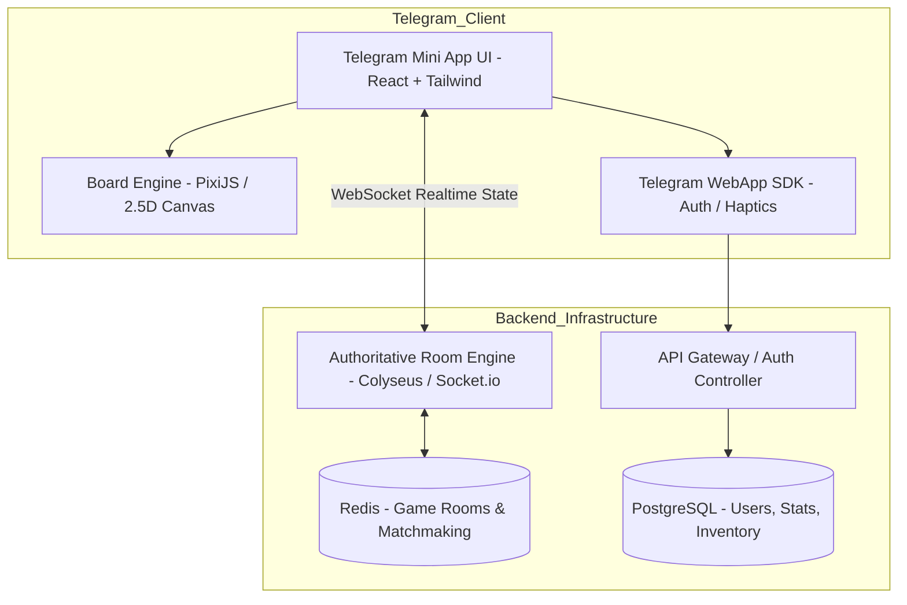

# Telegram Mini App Monopoly: Архитектура и MVP План

## 1. Анализ референсов и проблемы Monopoly One на Mobile

### Слабые места Monopoly One на мобильных устройствах:
1. **Горизонтальный 2D лейаут**: Полная квадратная доска со всеми полями на вертикальном экране телефона (соотношение 9:16 / 9:19) становится микроскопической, текст и иконки не читаются.
2. **Перегруженный десктопный UI**: Множество мелких всплывающих окон, панелей игроков и чатов закрывают всё игровое поле.
3. **Сложная торговля и аукционы**: Мелкие кнопки, нет адаптации под управление одним пальцем (one-thumb UX).

### Что берем из ваших референсов:
1. **2.5D / Изометрическая перспектива доски**: Как на референсах (Coin Master / Board Kings стиль), доска повернута под углом к камере, что позволяет эффективно заполнить вертикальный экран.
2. **Нижняя зона управления (Thumb Zone)**: Огромная кнопка броска кубика по центру внизу с анимацией и тактильной отдачей (Telegram Haptic Feedback).
3. **Bottom Sheets (шторки снизу)**: Карточки недвижимости, меню покупки, обмена и управления филиалами выезжают снизу на 50-70% экрана, не ломая обзор.
4. **Современный Casual UI**: Яркие объемные карточки, сочные цвета, крупные шрифты, плавные микроанимации.

---

## 2. Архитектура системы

---

## 3. Рекомендуемый стек технологий

### Frontend (Клиент TMA)
- **Фреймворк**: React 19 + TypeScript + Vite (быстрая сборка, минимальный размер бандла для моментальной загрузки в Telegram).
- **Рендеринг поля**: **PixiJS** или **Phaser** (2.5D изометрия / спрайты) — обеспечивает 60 FPS на любых смартфонах, в отличие от тяжелых 3D движков.
- **UI & Анимации**: TailwindCSS + Framer Motion / Lucide Icons.
- **Telegram SDK**: `@telegram-apps/sdk-react` (интеграция `initData`, `HapticFeedback`, `expand`, `BackButton`).

### Backend (Игровой сервер)
- **Платформа**: Node.js (TypeScript) + Fastify (REST API) + **Colyseus** (или Socket.io с authoritative state machine).
- **Архитектура комнат**: Authoritative Server (вся игровая логика, броски кубиков и расчет балансов считаются строго на сервере для предотвращения читов).
- **База данных**: PostgreSQL (хранение аккаунтов, профилей, инвентаря) + Prisma / Drizzle ORM.
- **Кэш / In-Memory**: Redis (состояния активных комнат, очереди матчинга, сессии).

---

## 4. Состав MVP (Минимально Жизнеспособный Продукт)

### Игровые механики MVP:
1. **Матчмейкинг / Лобби**:
   - Быстрый поиск игры на 2–4 человека.
   - Создание приватной комнаты с инвайт-ссылкой для друзей в Telegram (`t.me/bot?startapp=room_123`).
   - Режим тренировки с ботами (для тестирования и соло-игры).
2. **Игровое поле**:
   - Классический набор: 8 цветовых групп (улицы), 4 вокзала/транспортных узла, 2 коммунальные службы, Налоги, Шанс / Казна, Тюрьма.
   - Динамическая камера или изометрия с фокусом на текущего игрока.
3. **Игровой цикл**:
   - Бросок 2D/3D кубиков (серверная генерация чисел + клиентская анимация броска).
   - Перемещение фишек по клеткам.
   - Покупка свободного предприятия / выплата аренды владельцу.
   - Строительство филиалов/отелей при сборе монополии.
   - Таймер хода (20-30 сек) с авто-ходом/пассом при неактивности.
   - Банкротство и победа последнего оставшегося игрока.
4. **Telegram-специфика**:
   - Бесшовная авторизация по Telegram ID и аватару.
   - Haptic Feedback (вибрация при броске кубика, покупке, выпадении дубля).

---

## 5. Локальный запуск и тестирование на ПК (Tunneling для TMA)

Для запуска сервера на вашем локальном ПК с возможностью тестировать с реального телефона через Telegram:
1. **HTTPS Туннелирование**: Telegram Mini App строго требует HTTPS. Для этого на ПК используется `Cloudflare Tunnels (cloudflared)` или `ngrok` (бесплатно выдают публичный HTTPS адрес на ваш локальный порт).
2. **Интеграция с BotFather**: Полученный HTTPS адрес указывается в настройках WebApp бота в `@BotFather`.
3. **Бесшовный переезд на VPS**: Архитектура проекта строится на базе Docker Compose / Node.js сервисов, поэтому перенос на боевой сервер в будущем займет буквально пару команд.

---

## 6. Поэтапный план реализации (Roadmap)

### Этап 1: Игровой движок и логика (Backend Core)
- [ ] Разработка State Machine монополии на TypeScript (правила, перемещение, покупка, аренда, монополии, банкротство).
- [ ] Серверная синхронизация через Colyseus/Socket.io с валидацией ходов.
- [ ] Matchmaking и управление игровыми комнатами.

### Этап 2: Клиентская часть и рендеринг поля (Frontend Core)
- [ ] Настройка проекта Vite + React + Tailwind + TMA SDK.
- [ ] Разработка 2.5D изометрической доски на PixiJS/Canvas.
- [ ] Анимации броска кубиков, движения фишек и всплывающих цифр денег (+/-$).
- [ ] Bottom Sheet интерфейсы для карточек полей, покупки и управления недвижимостью.

### Этап 3: Telegram интеграция и лобби
- [ ] Валидация Telegram `initData` на бэкенде.
- [ ] Главное меню (лобби, кнопка «Играть», профиль со статистикой).
- [ ] Система инвайтов друзей через `Telegram Share Link`.

### Этап 4: Полировка, тестирование и баланс
- [ ] Подключение Telegram Haptic Feedback на ключевые действия.
- [ ] Тестирование мультиплеера на 2-4 игрока и сценариев переподключения (reconnect).
- [ ] Оптимизация производительности для бюджетных мобильных устройств.
